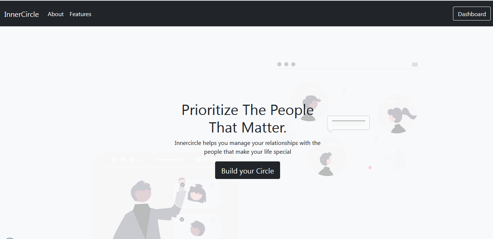

# InnerCircle
## Personal Relationship Management Web Application
The Personal relationship management web application InnerCircle is a relationship manager built using Python and Django. It allows users to privately add members to their circle, send them broadcasts, invite them to events and send them lists, as well as have access to an AI assistant.
 
 
 

 
 
 

## About
This is my final Project for ALX/Holberton School Backend Specialization.

 
 
 

## Features
+ Add People to your private circle.
+ Sort circle members into groups.
+ Send members broadcasts.
+ Invite members to events.
+ Event RSVP for invited members.
+ Send members lists.
+ List Item Check for members.
+ AI Assistant.

 
 
 

## Technology
+ SqLite
+ Python 
+ Django
+ Django Rest Framework
+ OpenAI
+ JavaScript/HTML/CSS/SASS/Bootstrap

 
 
 

## License
MIT License

 
 
 

## Contact
Please feel free to contact me if you have questions or feedback

### Pretty Pandey
email: prettypandeypearl@gmail.com
