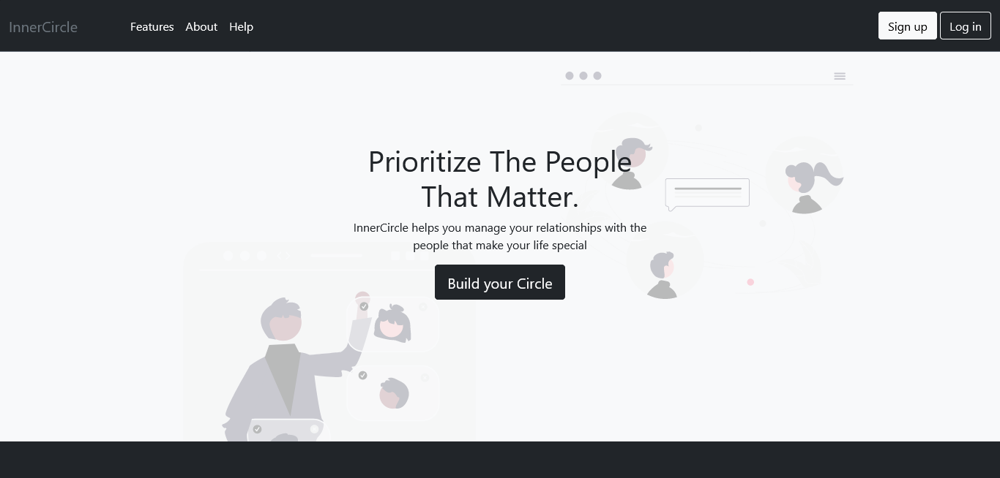

# InnerCircle

## InnerCircle: Elevate Your Personal Network
Welcome to InnerCircle, the culmination of my ALX/Holberton School Back End Specialization course—an innovative and secure relationship tracker and manager. Unlike typical social platforms, InnerCircle is your private sanctuary, designed to streamline and enhance your personal network like a sophisticated phonebook.

### Description:
InnerCircle is where your connections flourish. Safeguard your relationships by adding individuals to your exclusive circle, organized seamlessly into custom groups. Unlock the power to share private broadcasts, effortlessly send out event invitations, and exchange curated lists with those who matter most. Navigate your social world with the added support of an intelligent AI assistant.

### Features:
+ Secure Access: User authentication ensures a private and personalized experience.
+ Tailored Organization: Create and manage members and groups with intuitive ease.
+ Personalized Communication: Send private broadcasts, event invitations, and lists to stay connected.
+ AI Guidance: A smart assistant stands ready to assist you on your relational journey.

### Project Stack:
+ Backend:  Python, Django, Django Rest Framework, OpenAI
+ Frontend: JavaScript, HTML5, CSS3, SASS, Bootstrap

 

Elevate your personal network with InnerCircle: an all-encompassing solution for managing and nurturing the connections that make a difference in your life.

## License
MIT License

## Contact
Please feel free to contact me if you have questions or feedback

Pretty Pandey  
Full Stack Programmer 
prettypandeypearl@gmail.com
<a href="https://www.linkedin.com/in/prettypandey"> LinkedIn</a>
<a href="https://www.prettypandey.tech"> Portfolio</a>

